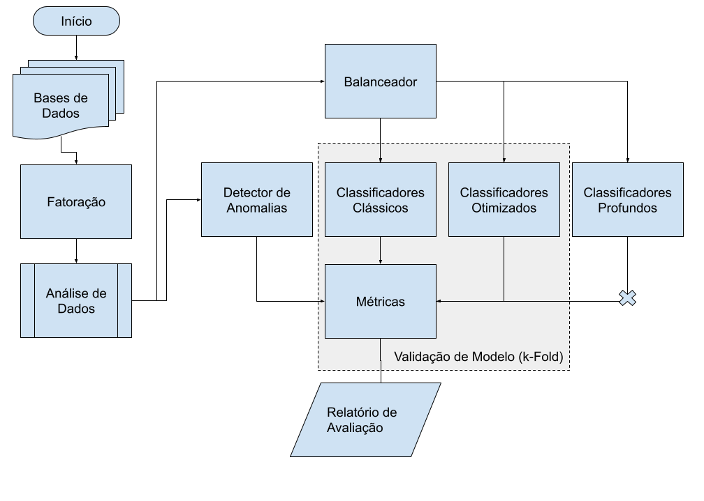
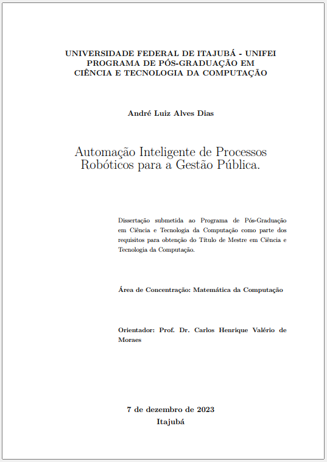
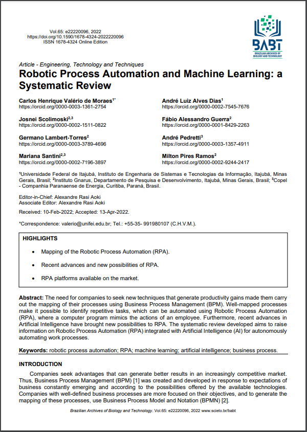

# Automação Inteligente de Processos Robóticos para a Gestão Pública

Este trabalho destaca uma pesquisa abrangente sobre a aplicação da Inteligência Artificial (I.A.) na gestão de recursos humanos, com um foco específico na identificação da insatisfação dos funcionários por meio de abordagens de aprendizado de máquina. A investigação incluiu uma revisão de artigos científicos que discutiam tanto a implementação da I.A. no contexto de recursos humanos quanto o uso de técnicas de aprendizado de máquina para detectar casos de *turnover/attrition*, além da relação de insatisfação e os casos de *turnover/attrition*.

Para avaliar essas abordagens, foram selecionadas quatro bases de dados públicas validadas. Três delas continham dados fictícios de funcionários e uma continha dados reais de *turnover* de funcionários. Cada base de dados passou por um processo de fatorização de campos textuais, seguido por análises para destacar as distribuições dos dados em cada conjunto. 

Na condução da pesquisa, diferentes abordagens de aprendizado de máquina foram aplicadas a cada uma das bases, com o objetivo de verificar a viabilidade de identificar a insatisfação por meio da I.A. As técnicas utilizadas incluíram detecção de anomalias ou novidades, classificadores e conjuntos de classificadores otimizados. Os resultados foram quantificados, revelando pontuações promissoras, com desempenhos superiores a 90\%. Esses resultados destacam a eficácia geral do aprendizado de máquina na identificação da insatisfação dos funcionários, demonstrando seu potencial para aplicações práticas no ambiente de recursos humanos.

Confira um vídeo de apresentação da proposta do mestrado em:

**Palavras-chaves**: Inteligência Artificial, *turnover*, *attrition*, aprendizado de máquina, insatisfação de funcionário. 

## Metodologia Proposta

## Dissertação

## Artigo Publicado

## Análise Desenvolvida

[Código Fonte](Proposta_Detecção_Turnover_Mestrado.ipynb)

Executar o código fonte no Google Colab: 
